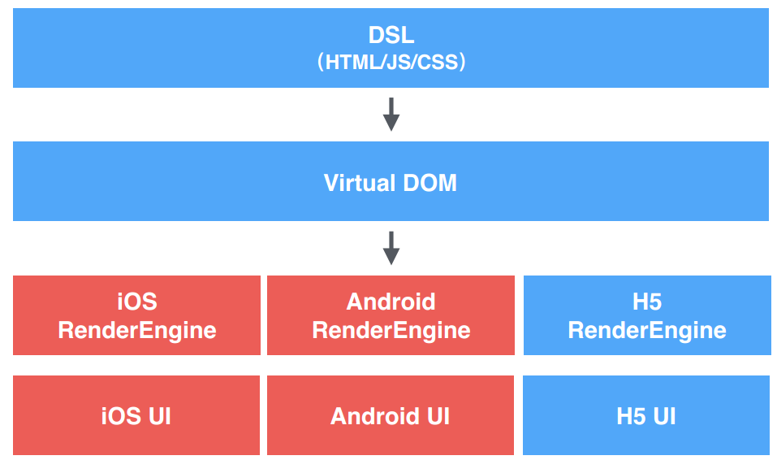

本篇博客记录一下自己对Weex的一些学习过程

# 什么是Weex？Weex能做什么？
Weex是阿里巴巴集团开源的一个动态化方案。

>在我们对移动开发最佳实践的思考中，我们认为移动开发的未来是更平衡的方案，一定是性能和动态性兼得。第二个，它一定是开放互联的，PC端一直也是这样的， 也是非常好的状态。我们觉得移动互联网将来肯定也是基于更大众化的技术体系，没有平台之间的隔阂，简单直接易用，这是我们最希望看到的。基于这些设想，我 们有了Weex方案。

Weex编写的页面天然的支持组件化，首先，我们的界面可以是一个组件化的，把一个复杂界面分成每个组件，刚才演示的都是简单的组件，每个组件都可以看成是一段 template，style，script，放到模型里，对应到界面的结构，样式细节，行为定义。在view里面我们倾向于把数据和视图当中需要展示和 需要有动态变化的部分做一个数据绑定，绑定之后我如果想更改界面的话，通过改变数据就可以做到。

# Weex的一些相关网站
* https://github.com/weexteam/article/issues
* https://github.com/apache/incubator-weex
* https://weex.incubator.apache.org/cn/
* http://weex.help/

# Weex环境
weex的环境安装很简单：
https://weex.incubator.apache.org/cn/guide/set-up-env.html

